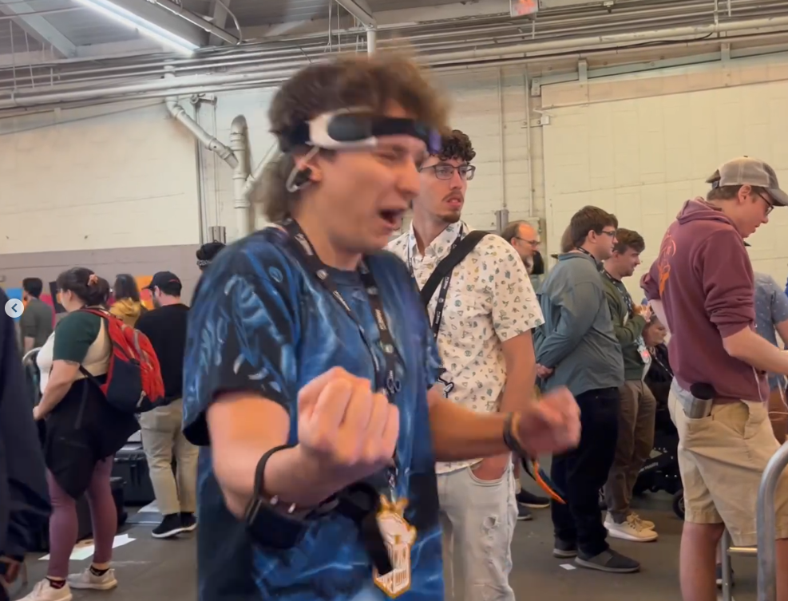
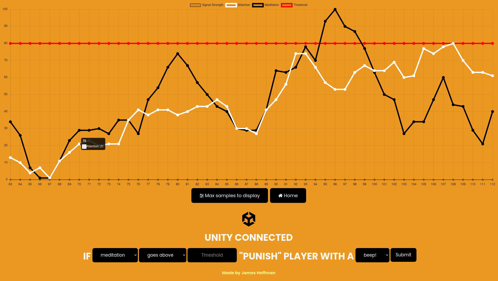
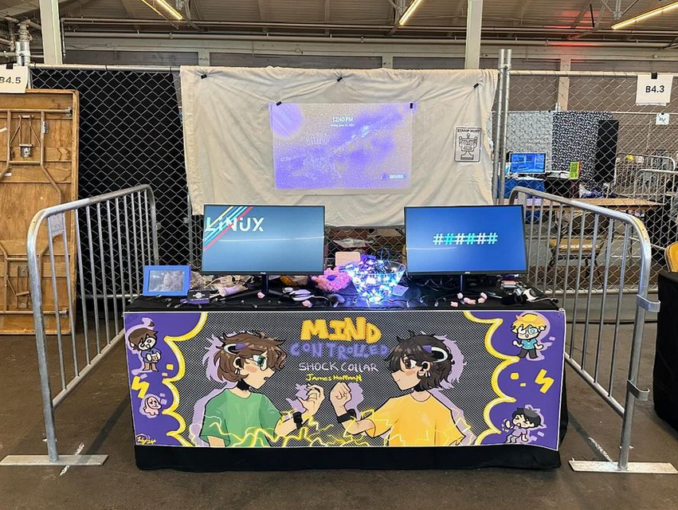

# A mind controlled shock collar (for humans)
## Overview

  
   Slimecicle getting shocked by my invention

This is the repo with all the code I used to make a mind controlled shock collar that got me accepted to exhibit at [Open Sauce!](https://opensauce.com)  
It also includes all the EEG data I collected while exhibiting at Open Sauce, atleast for day 1. You can find it all in `data.final.day.one`.

*Please note that this is the code in its spaghetti, unclean, rapidly-finished-hours-before-I-left-for-Open-Sauce, glorious mess. So don't expect too much.*

It uses the [Mindflex](https://en.wikipedia.org/wiki/Mindflex) toy and the [Brain](https://github.com/kitschpatrol/Brain) Arduino library to get the EEG values. It then sends them to the server.
The Mindflex and collar both use a ESP8266 in order to communicate data back to the server over UDP. This means that the entire setup is wireless. 

You can then use it from a web interface that uses Flask and [Chart.js](https://www.chartjs.org/)

You can use this web interface to play the "game"

For a more detailed overview on how this all works, you can see my blog post here. (Not finished writing)

## The "Game"

  

To play the game itself, you put on both the collar and Mindflex, and you set a threshold (red line) for either meditation or attention. If you pass this threshold, you will be shocked with a varying power level depending on how far you got from the threshold. 

For example, if you set the meditation threshold to something like 80, and the condition to be going above, you would get shocked the second that you start to relax.

  
   My booth at Open Sauce

